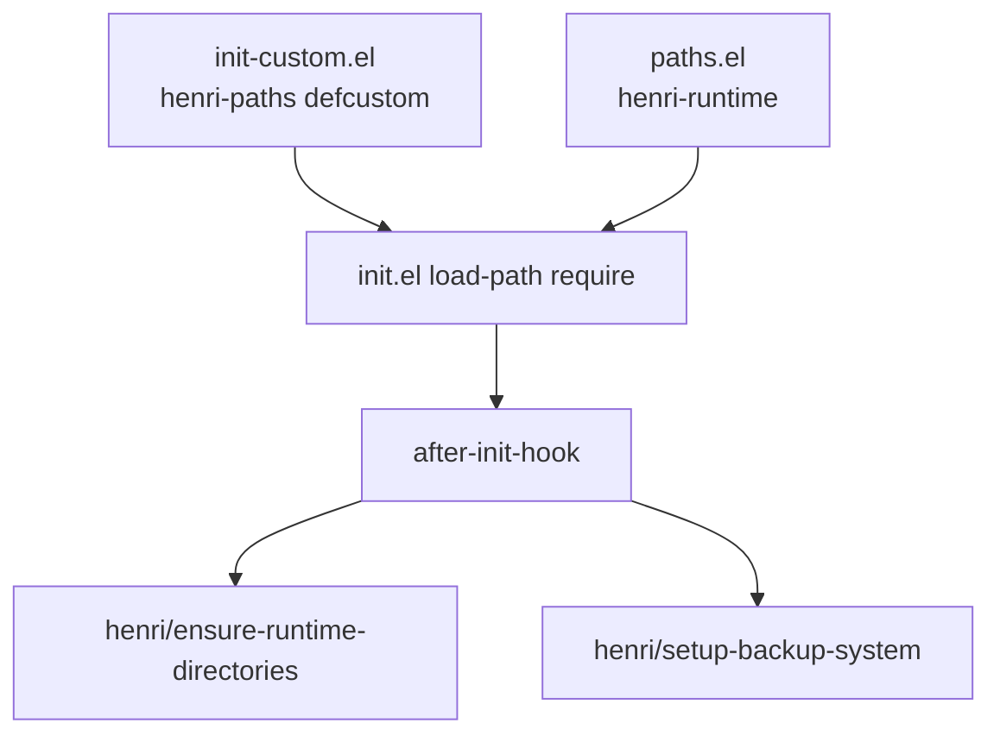

# henri.emacs.d 架构文档 (Architecture)

> 实现框架文档：功能实现框架与技术细节说明。
> 最近更新: 2026-05-02（`lisp/ops` 分层：`lib-*` / `doctor` / `profiles`；分阶段 `henri-first-*-hook`；`exec-path-from-shell` 改首键初始化）

---

## 1. 系统总览

配置以 `early-init.el` 承担尽早执行的启动优化，以 `init.el` 为入口，按需加载 `lisp/` 下管理与功能模块（基础管理、界面、编程、写作、运维等）。包管理以 `use-package` 与 ELPA（含镜像）为主；编程侧以 LSP（Eglot）与 Tree-sitter 等为支撑；写作侧以 Org、Markdown、LaTeX 等为主线。**本地 Git**：`init-managing.el` 中 Magit + `diff-hl` + 冲突时 `smerge-mode`。**Markdown 预览**：`init-writing.el` 中 `pandoc`/EWW 与可选 `grip` 双路径。启动首页为 [`lisp/init-dashboard.el`](lisp/init-dashboard.el) 中 `henri/dashboard`，由 `initial-buffer-choice` 选择；**已移除对 `dired` 的 advice 与定时清理**。详见仓库根目录 `README.md` 中的模块说明与系统要求。

## 2. 模块结构

- **入口**：`early-init.el`、`init.el`
- **核心 Lisp**：`lisp/init-*.el`（如 **dashboard**、managing、styling、programming、writing、custom、rime 等）
- **编程语言拆分**：`lisp/programming_languages/`
- **写作与 Org**：`lisp/writing/`（含金 `lisp/writing/org/`、`lisp/writing/LaTeX/`）
- **运维与通用库**：`lisp/ops/`
  - **治理**：[`paths.el`](lisp/ops/paths.el)（本机目录）、[`backup.el`](lisp/ops/backup.el)、[`status.el`](lisp/ops/status.el)、[`profiles.el`](lisp/ops/profiles.el)（可选 `profile-<name>.el`）、[`doctor.el`](lisp/ops/doctor.el)（`henri/doctor`）
  - **通用库**：[`lib-hooks.el`](lisp/ops/lib-hooks.el)（`henri-first-{input,buffer,file}-hook`）、[`lib-system.el`](lisp/ops/lib-system.el)、[`lib-fonts.el`](lisp/ops/lib-fonts.el)、[`lib-files.el`](lisp/ops/lib-files.el)（大文件、`henri-buffer-real-p`、首个文件后 `global-so-long-mode`）

## 3. 数据流

- **入口加载**：`init.el` 在初始化 `package.el` 后扩展 `load-path`，依次 `require`：`fix-warnings`、`init-custom`、`paths`、`profiles` 并 **`(henri/load-profile)`**、`lib-system`、`lib-hooks`、`lib-fonts`、`lib-files`、`doctor`、`init-dashboard`，再加载 `init-managing`、`init-styling`、`init-programming`、`init-writing`、`status`、`backup`。
- **笔记与资源**：`henri-notes-directory`（及派生的 Journal、Academic 路径）与 `henri-org-html-themes-directory`（默认 `lisp/writing/org/org-html-themes/`）由 `lisp/init-custom.el` 集中定义；Org HTML 主题脚本见同级 `install-themes.sh`。
- **备份与运行时**：[`lisp/ops/paths.el`](lisp/ops/paths.el) 提供 `henri-var-directory`、`henri-rime-directory` 等；**`henri/ensure-runtime-directories` 在 `after-init-hook` 中创建目录**，与 [`lisp/ops/backup.el`](lisp/ops/backup.el) 同阶段衔接。`elpa/`、`tree-sitter/`、`transient/` 等仍落在 `user-emacs-directory` 默认或约定子路径；**未使用 `no-littering`**，未统一重定向第三方包状态文件路径。

## 3.1 路径分层（henri-paths vs henri-runtime）

- **`henri-paths`**：笔记/项目/Conda/LeetCode/Org 主题根、**`henri-shell`** 等用户可改路径。
- **`henri-runtime`**：`var/`、`.local/*`、`tree-sitter/`、`rime/`、`transient/` 等本机落盘命名空间（无业务语义）。

## 4. 关键技术决策

- **可移植路径**：个人机器相关路径一律为 `henri-*` `defcustom`（组 `henri-paths` / `henri-core`），模块内仅 `expand-file-name` 派生子路径；默认 shell 为 **`henri-shell`**（`quickrun-shell`、`explicit-shell-file-name`、`exec-path-from-shell-shell-name`）。
- **重复配置收敛**：GC 以 `early-init.el` + `init.el` 启动钩子为主；**macOS 上 `exec-path-from-shell`** 在 [`init-managing.el`](lisp/init-managing.el) 中配置后，由 **`henri-first-input-hook`** 调用 `henri/initialize-shell-env` 完成 PATH 注入（不再使用仅首进 `prog-mode` 的钩子，避免与首键重复/死代码）。
- **分阶段启动**：[`lib-hooks.el`](lisp/ops/lib-hooks.el) 定义 `henri-first-input-hook`（首个 `pre-command` 前）、`henri-first-buffer-hook`（首个非 dashboard、非 minibuffer 的窗口缓冲变化后，供 centaur-tabs 等）、`henri-first-file-hook`（首个 `find-file-hook` 前，如 `global-so-long-mode`、延迟的 `diff-hl`）；与 Doom 的 doom-first-* 语义类似。
- **LSP 保存格式化**：Eglot 仅在 `eglot-managed-mode-hook` 里 **buffer-local** 挂载 `before-save-hook`，并尊重 `henri-lsp-auto-format` 与 `henri-lsp-format-size-threshold`。
- **警告**：`lisp/fix-warnings.el` 仅保留有限的 `byte-compile-warnings` 与 `warning-suppress-types`，不再包装 `display-warning`。
- **运行时布局**：`lisp/ops/paths.el` 在 **`after-init-hook`** 创建目录并暴露 `defcustom`（`henri-runtime`）；不把 `recentf`、`projectile` 等全局重定向到 `var/`（与 `no-littering` 策略区分）。
- **本地 Git 与 Markdown**：Magit 快捷键前缀 `C-c g`（见 `init-managing.el`）；`diff-hl` 显示工作区改动；冲突文件自动启用 `smerge-mode`。Markdown 离线预览依赖 `pandoc`，GitHub 风格预览依赖 `grip` 与 `henri-enable-grip`（见 `init-writing.el`）。

## 5. 目录映射

| 路径 | 说明 |
|------|------|
| `early-init.el` | 启动早期优化与相关钩子 |
| `init.el` | 主入口：包管理与模块加载 |
| `lisp/init-dashboard.el` | 启动 dashboard、`henri/*notes*' 辅助函数、`initial-buffer-choice` |
| `lisp/` | 功能模块化 Elisp |
| `lisp/programming_languages/` | 按语言的编程配置 |
| `lisp/writing/` | 写作与 Org、LaTeX 相关 |
| `lisp/ops/paths.el` | 本机目录约定：`henri-var-directory`、`henri-rime-directory` 等；`after-init-hook` 中 `make-directory` |
| `lisp/ops/backup.el` | 备份与自动保存（相对 `henri-var-directory`） |
| `lisp/ops/status.el` | 模块状态/诊断辅助 |
| `lisp/ops/lib-hooks.el` | 分阶段 `henri-first-*-hook` |
| `lisp/ops/lib-system.el` | OS / `henri/executable-p` |
| `lisp/ops/lib-fonts.el` | 字体与运行时缩放 |
| `lisp/ops/lib-files.el` | 大文件、buffer 真假判定、so-long |
| `lisp/ops/profiles.el` | `henri/load-profile` |
| `lisp/ops/doctor.el` | `henri/doctor` |
| `tree-sitter/` | Tree-sitter 相关资源 |
| `.local/`、`var/` | 本地缓存、备份、自动保存等运行时目录（依仓库 .gitignore 为准） |
| `docs/` | 本文档系统（specs / jobs / legacy / reports / work-notes） |
